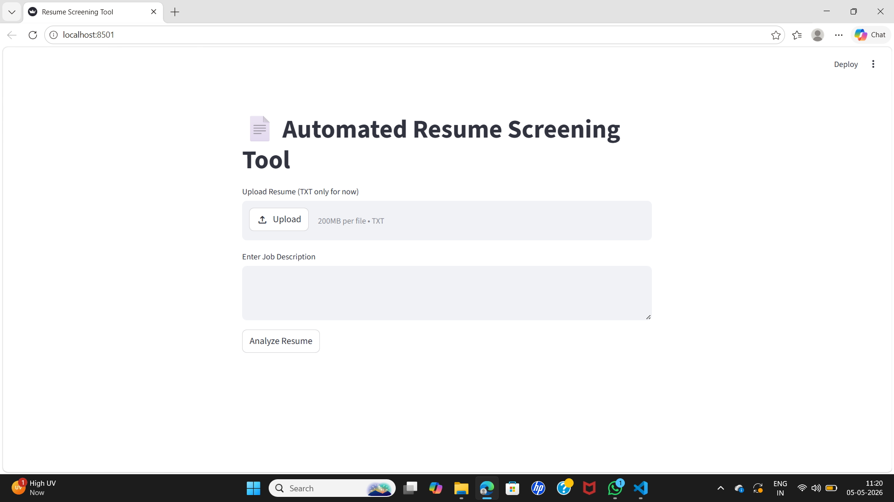
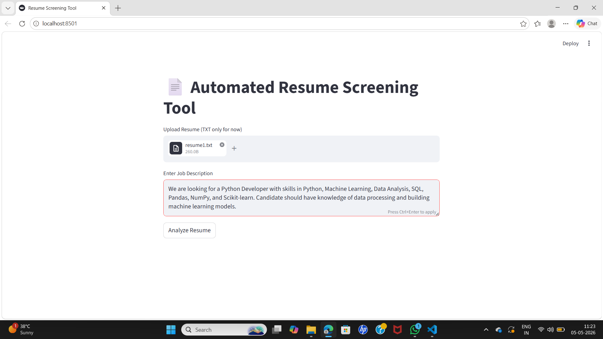
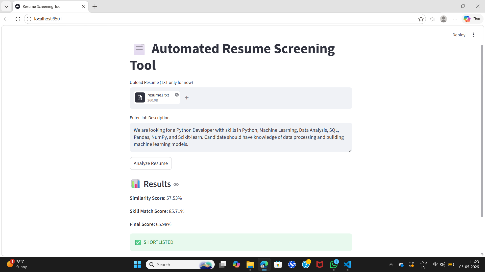
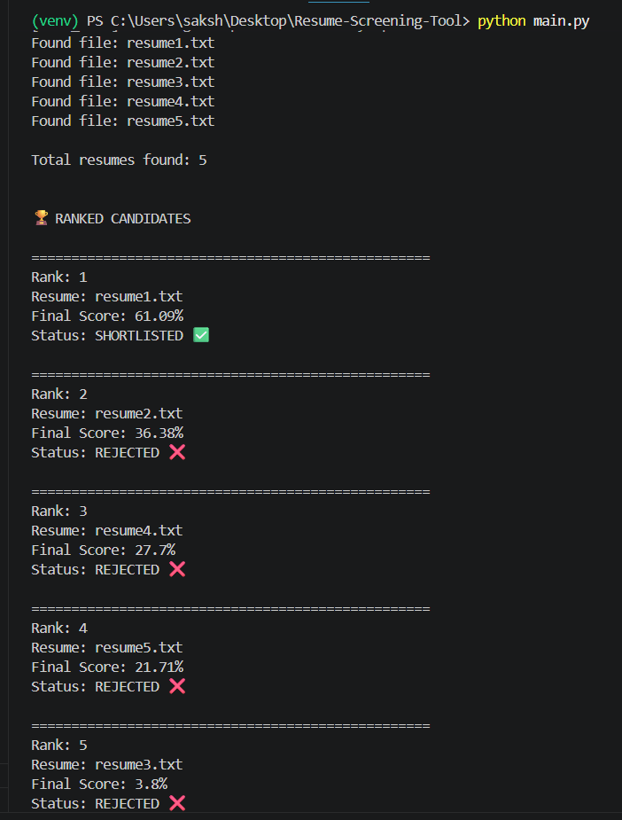
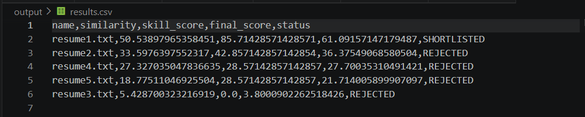

## 📄 Automated Resume Screening Tool

---

## 📌 Project Overview

The Automated Resume Screening Tool is an AI-based system that filters, ranks, and shortlists candidates by comparing resumes with a job description.

It simulates how real-world Applicant Tracking Systems (ATS) work in companies.

---

## ❗ Problem Statement

Companies receive hundreds of resumes for a single job role, making manual screening:

- Time-consuming
- Error-prone
- Inconsistent

This project automates resume screening using NLP and machine learning.

---

## 🌍 Industry Relevance

This project is inspired by real ATS systems used in platforms like LinkedIn, Indeed, and Naukri.

It demonstrates:

- Resume parsing
- Keyword matching
- AI-based scoring
- Automated shortlisting

---

## 🚀 Features

- Resume parsing (TXT, PDF, DOCX)
- Text cleaning using NLP
- Skill extraction and matching
- TF-IDF vectorization
- Cosine similarity scoring
- Final weighted scoring system
- Candidate ranking
- Shortlisting / Rejection
- CSV report generation
- Streamlit UI for interaction

---

## 🛠️ Tech Stack

- Python
- Pandas
- NumPy
- Scikit-learn
- NLTK
- pdfplumber
- python-docx
- Streamlit

---

```

## 📁 Folder Structure

Automated-Resume-Screening-Tool/
│
├── data/
│   ├── resumes/
│   └── job_description/
│
├── src/
│   ├── parser.py
│   ├── cleaner.py
│   ├── matcher.py
│   ├── scorer.py
│   └── utils.py
│
├── output/
│   └── results.csv
│
├── images/
├── docs/
├── main.py
├── app.py
├── requirements.txt
└── README.md

```

---

## ▶️ How to Run the Project

1. Clone Repository

git clone https://github.com/keshkarsaloni-lab/Automated-Resume-Screening-Tool.git
cd Automated-Resume-Screening-Tool

---

2. Create Virtual Environment

python -m venv venv

---

3. Activate Environment

Windows:
venv\Scripts\activate

Mac/Linux:
source venv/bin/activate

---

4. Install Dependencies

pip install -r requirements.txt

---

5. Run Main Program

python main.py

---

6. Run Streamlit UI (Optional)

streamlit run app.py

---

## 📊 Sample Output

🖥️ Terminal Output

🏆 FINAL RESULTS

Rank 1: resume1.txt
Score: 61.09%
Status: SHORTLISTED

Rank 2: resume2.txt
Score: 36.38%
Status: REJECTED

Rank 3: resume4.txt
Score: 27.70%
Status: REJECTED

Rank 4: resume5.txt
Score: 21.71%
Status: REJECTED

Rank 5: resume3.txt
Score: 3.80%
Status: REJECTED

📁 Report saved at: output/results.csv

---

## 📄 CSV Output

name, similarity, skill_score, final_score, status
resume1.txt, 50.53, 85.71, 61.09, SHORTLISTED
resume2.txt, 33.59, 42.85, 36.38, REJECTED
resume4.txt, 27.32, 28.57, 27.70, REJECTED
resume5.txt, 18.77, 28.57, 21.71, REJECTED
resume3.txt, 5.42, 0.00, 3.80, REJECTED

---

## 📸 Screenshots

### 🖥️ Streamlit UI (Empty)


### ✏️ Input Screen


### 📊 Result Screen


### 🖥️ Terminal Output


### 📄 CSV Report


---

## 🧠 Learning Outcomes

- Understanding of NLP preprocessing
- TF-IDF and cosine similarity
- Resume parsing techniques
- ATS system simulation
- Modular Python project design
- Streamlit UI development

---

## 🎯 Conclusion

This project demonstrates a real-world resume screening system using AI and NLP, making the hiring process faster and more efficient.

---

## 👩‍💻 Author

Saloni Keshkar

---